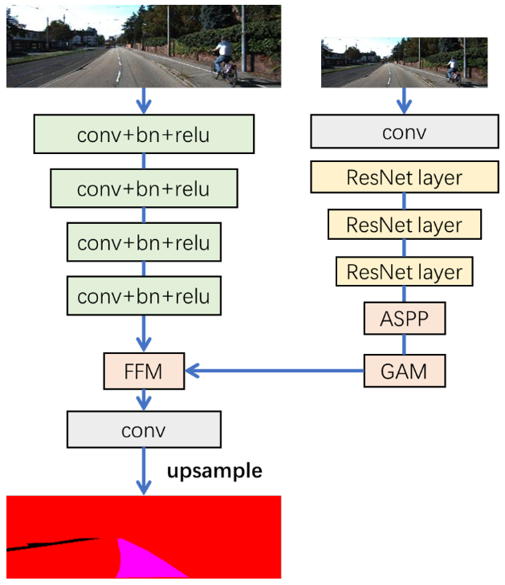
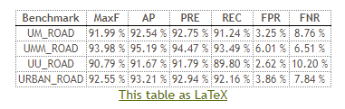
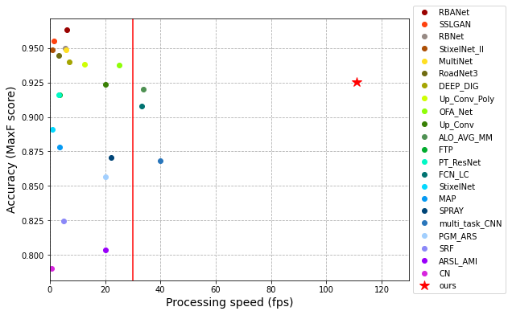

# RoadNet-RT
Lightweight and Real-Time Road Segmentation Network


## Requirements
- python==3.6
- keras==2.3.1
- tensorflow-gpu==1.14.0
- opencv=3.4.2
- matplotlib==3.1.1
- albumentations==0.4.5
- h5py==2.10.0

## How to use
### Step 1
Install the enviroment according to the requirement above.
### Step 2
Install Segmentation Models
```
$ pip install -U segmentation-models
```
### Step 3
If inference, run the command bellow
```
$ python roadnet_test.py
```


## Result on KITTI leaderboard
The inference speed on GTX1080 is about 9ms/frame, with accuracy 92.55%. [Link to KITTI](http://cvlibs.net/datasets/kitti/eval_road_detail.php?result=44016247c4c4c7fef441921705a40492fa8dd661).





## Citation
```
@ARTICLE{roadnet-rt2021,
  author={Bai, Lin and Lyu, Yecheng and Huang, Xinming},
  journal={IEEE Transactions on Circuits and Systems I: Regular Papers}, 
  title={RoadNet-RT: High Throughput CNN Architecture and SoC Design for Real-Time Road Segmentation}, 
  year={2021},
  volume={68},
  number={2},
  pages={704-714},
  doi={10.1109/TCSI.2020.3038139}}
```

## Acknowledgement
This repo is heavily relied on [Segmentation Models](https://github.com/qubvel/segmentation_models). We thank Pavel Yakubovskiy for his great work.

